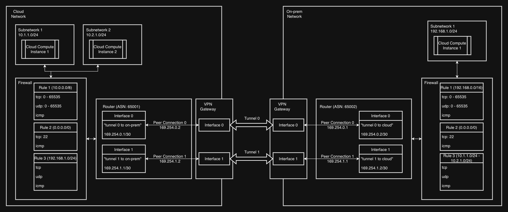

# config_gcp_ha_vpn
Terraform solution to Google Cloud Skills Boost Lab: Configuring Google Cloud HA VPN

## General description



This Terraform project is ready to deploy a network infrastructure consisting on 2 separate networks: Cloud and On-prem.

Both networks are connected to each other through a GCP High Availability VPN: 2 independent gateway VPN tunnels connecting each to 2 interfaces from both network's routers.

## How the code works

### Prerequisites

To deploy this infrastructure, you need to have `terraform` installed. Look at instructions [here](https://developer.hashicorp.com/terraform/install).

### Playing around

To mess around the code, you can use the `local` configuration. Go to `./environments/local/` and run:
```sh
terraform init
```
This installs locally the external modules and providers.

You can automatically format the code with:
```sh
terraform fmt
```
Or recursively from the root:
```sh
terraform fmt -recursive
```

From the local environment folder, run:
```sh
terraform validate
```
to check that the project doesn't contain syntax errors.

### Deployment in GCP

Before deploying, you need to authenticate into GCP with:
```sh
gcloud auth application-default login
```

And your GCP project needs to have the following APIs entabled:

- Compute Engine API
- VPC API

First, you need to go to `environments/remote` and copy `terraform.tfvars.sample` as `terraform.tfvars`. Then set the project ID:
```conf
project_id = <your-gcp-project-id>
```

Second, go to `environments/remote/backend.tf` and set the backend bucket name:
```conf
bucket = <your-terraform-state-bucket>
```

If your backend bucket is not yet created, you can do so with:
```sh
gsutil mb gs://your-terraform-state-bucket
```

You can preview your deployment with:
```sh
terraform plan
```

And finally deploy the infrastructure with:
```sh
terraform apply
```

### Cleanup
To destroy the infrastructure:
```sh
terraform destroy
```
